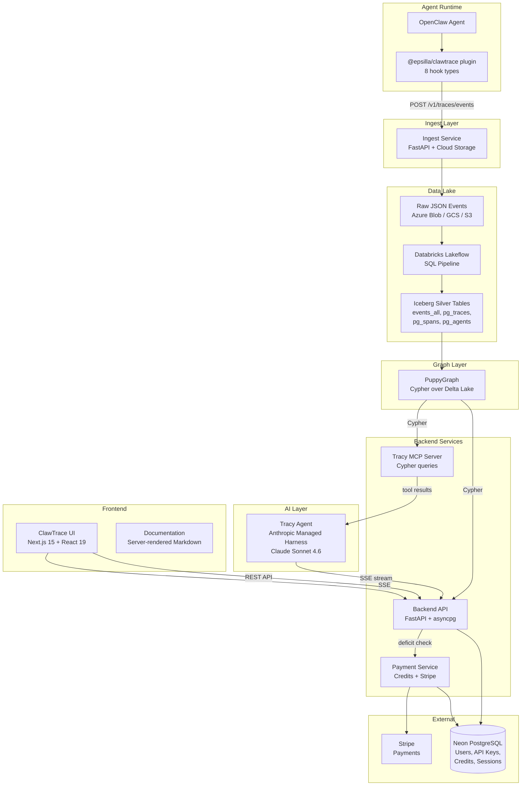

<p align="center">
  
</p>

<h3 align="center">Make your OpenClaw agents better, cheaper, and faster.</h3>

<p align="center">
  <a href="https://clawtrace.ai">Website</a> &nbsp;&middot;&nbsp;
  <a href="https://clawtrace.ai/docs">Documentation</a> &nbsp;&middot;&nbsp;
  <a href="https://clawtrace.ai/docs/ask-tracy">Ask Tracy</a>
</p>

<p align="center">
  
  
</p>

---

## The Problem

AI agents are opaque. You deploy an OpenClaw agent, it runs autonomously, and you hope it works. When something goes wrong, you have no idea:

- **Why did this run cost $4.70 when it usually costs $0.30?** Was it a runaway context window? A retry loop? A wrong model?
- **Why did the agent fail silently?** Which step broke? What was the input that caused it?
- **Is the agent drifting?** Is it doing the same work as last week, or has behavior changed?
- **Where is the bottleneck?** Which step takes 80% of the wall clock time?

You end up reading raw logs, guessing at token counts, and manually tracing execution paths. This doesn't scale.

## The Solution

ClawTrace is the observability platform for OpenClaw agents. It captures every trajectory (a complete agent execution from start to finish), breaks it down into spans (individual LLM calls, tool executions, sub-agent delegations), and gives you the tools to understand what happened, why, and what to fix.

### What makes ClawTrace different

**Tracy, your OpenClaw Doctor Agent.** Every other observability tool gives you dashboards and expects you to interpret the data yourself. ClawTrace includes Tracy, an AI analyst that lives inside the platform. Ask Tracy a question in natural language, and she queries your trajectory data in real time, generates charts, spots anomalies, and delivers specific optimization recommendations.

<p align="center">
  
</p>

### Core Features

| Feature | Description |
|---------|-------------|
| **Execution Path** | Interactive trace tree showing every LLM call, tool use, and sub-agent delegation with full input/output payloads |
| **Call Graph** | Node-link diagram visualizing relationships between agents, tools, and models |
| **Timeline** | Gantt chart revealing parallelism, bottlenecks, and idle gaps |
| **Cost Estimation** | Per-span cost calculation with 80+ model pricing entries covering OpenAI, Anthropic, Google, DeepSeek, Mistral, Qwen, GLM, Kimi, and more. Cache-aware pricing (fresh input vs cached input vs output) |
| **Ask Tracy** | Conversational AI analyst that queries your trajectory graph, generates ECharts visualizations, and provides actionable recommendations |
| **Consumption Billing** | Pay for what you use with credits. No seat-based subscriptions |

## Getting Started

### 1. Install the ClawTrace plugin on your OpenClaw agent

```bash
openclaw plugins install @epsilla/clawtrace
```

### 2. Authenticate with your observe key

```bash
openclaw clawtrace setup
```

### 3. Restart the gateway

```bash
openclaw gateway restart
```

That's it. Every trajectory now streams to ClawTrace automatically.

Visit [clawtrace.ai](https://clawtrace.ai) to sign up and get 100 free credits. Refer a friend and you both get 200 bonus credits.

## Architecture



### Data Flow

1. **Capture**: The `@epsilla/clawtrace` plugin intercepts 8 OpenClaw hook types: `session_start`, `session_end`, `llm_input`, `llm_output`, `before_tool_call`, `after_tool_call`, `subagent_spawning`, `subagent_ended`
2. **Ingest**: Events are batched and POSTed to the ingest service, which writes partitioned JSON to cloud storage (`tenant={id}/agent={id}/dt=YYYY-MM-DD/hr=HH/`)
3. **Transform**: Databricks Lakeflow SQL pipeline materializes raw events into 8 Iceberg silver tables every 3 minutes
4. **Query**: PuppyGraph virtualizes the Delta Lake tables as a Cypher-queryable graph (Tenant → Agent → Trace → Span with CHILD_OF edges)
5. **Serve**: The backend API runs Cypher queries, the payment service tracks credit consumption, and Tracy's MCP server provides graph access to the AI agent
6. **Display**: Next.js UI renders trace trees, call graphs, timelines, and Tracy's streamed responses with inline ECharts

### Monorepo Structure

```
clawtrace/
├── packages/clawtrace-ui/        Next.js 15 frontend (App Router, React 19, Drizzle ORM)
├── services/clawtrace-backend/   FastAPI backend (PuppyGraph, JWT auth, Tracy chat)
├── services/clawtrace-ingest/    FastAPI ingest (multi-tenant, cloud-agnostic storage)
├── services/clawtrace-payment/   FastAPI billing (consumption credits, Stripe, notifications)
├── plugins/clawtrace/            @epsilla/clawtrace npm plugin for OpenClaw
├── sql/databricks/               Lakeflow SQL pipeline (silver tables + billing tables)
└── puppygraph/                   PuppyGraph schema configuration
```

### Tech Stack

| Layer | Technology |
|-------|-----------|
| Frontend | Next.js 15, React 19, CSS Modules, ECharts, react-markdown |
| Backend | FastAPI, asyncpg, httpx, Pydantic Settings |
| Database | Neon PostgreSQL (users, credits, sessions), Drizzle ORM |
| Data Lake | Azure Blob Storage, Databricks, Delta Lake, Iceberg |
| Graph | PuppyGraph (Cypher over Delta Lake) |
| AI | Anthropic Managed Agents (Claude Sonnet 4.6), MCP protocol |
| Billing | Stripe, consumption-based credits |
| Deployment | Vercel (UI), Docker + Kubernetes (services) |

## Model Pricing

ClawTrace estimates per-span cost using a comprehensive pricing table covering 80+ models across all major vendors:

**Western vendors**: OpenAI (GPT-5.x, GPT-4.x, o-series), Anthropic (Claude Opus/Sonnet/Haiku), Google (Gemini 3.x/2.x/1.5), DeepSeek (V3, R1), Mistral (Large/Small/Codestral)

**Chinese vendors**: Alibaba Qwen (3.x Max/Plus/Flash), Zhipu GLM (5.x/4.x), Moonshot Kimi (K2.5), Baidu ERNIE (5.0/4.5), MiniMax (M2.x)

**Open source**: Llama 4/3.x, Mixtral, Stepfun

Cache-aware pricing: fresh input tokens, cached input tokens (~10% rate), cache write tokens, and output tokens are calculated separately for accurate cost estimation.

## Roadmap

- **Rubric-Based Evaluation** — Define quality rubrics, auto-score agent trajectories, catch regressions before deployment
- **A/B Testing** — Run agent variants side by side, compare cost, quality, and speed, promote winners with confidence
- **Version Control** — Track agent config changes over time, roll back to known good versions, audit who changed what
- **Self-Evolving Agents** — The long vision: agents that learn from their own trajectory data to continuously improve reliability, reduce costs, and adapt to new patterns automatically

## Development

### Frontend

```bash
cd packages/clawtrace-ui
npm install
npm run dev          # localhost:3000
npm run typecheck    # TypeScript validation
```

### Backend

```bash
cd services/clawtrace-backend
python -m venv .venv && source .venv/bin/activate
pip install -r requirements.txt
cp .env.example .env  # Edit with your credentials
uvicorn app.main:app --reload --port 8082
```

### Ingest

```bash
cd services/clawtrace-ingest
python -m venv .venv && source .venv/bin/activate
pip install -r requirements.txt
cp .env.example .env
uvicorn app.main:app --reload --port 8080
```

### Payment

```bash
cd services/clawtrace-payment
python -m venv .venv && source .venv/bin/activate
pip install -r requirements.txt
cp .env.example .env
uvicorn app.main:app --reload --port 8083
```

### Plugin

```bash
cd plugins/clawtrace
npm install
npm test
```

## Inspirations

This project was inspired by and builds upon the work in [openclaw-tracing](https://github.com/fengsxy/openclaw-tracing), a reference implementation for tracing OpenClaw agent executions. ClawTrace extends this foundation with production-grade observability, a graph-based query engine, consumption-based billing, and Tracy, the AI observability analyst.

## License

Apache 2.0. See [LICENSE](LICENSE) for details.

---

<p align="center">
  Built with ❤️ by <a href="https://epsilla.com">Epsilla</a>
</p>
