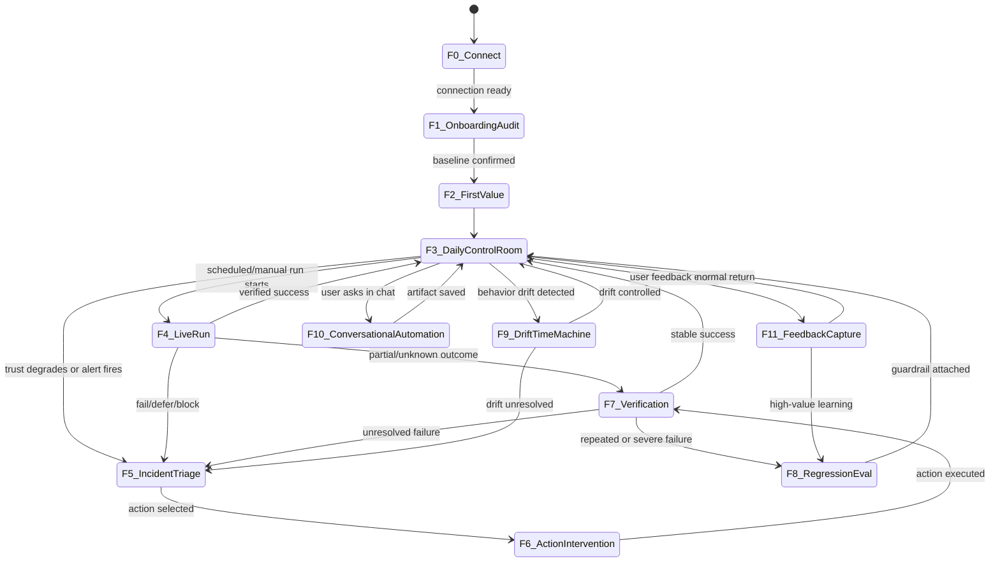

# ClawTrace User Journey Flow Spec

Last updated: 2026-03-24
Owner: Product + Design + Engineering
Status: Draft v1 (implementation-ready journey map)

## 1) Why This Exists

This document defines the end-to-end user journey across ClawTrace flows, starting from onboarding.

Primary objective: move users from "agent feels like a black box" to "I can diagnose and fix failures quickly, and repeated failures decline over time."

## 2) Journey Principles

1. Onboarding is a guided systems audit, not a generic setup wizard.
2. Daily home is a control room, not a chat app.
3. Every unhealthy state must end in a clear next action.
4. Known vs unknown evidence must always be explicit.
5. Incidents should become reusable assets (regression tests, alerts, runbooks), not one-off fire drills.
6. Cost must be explainable in the same flow as reliability, not in a separate dashboard context.

## 3) System Flows At A Glance

| Flow | Trigger | Primary Surface | User Question | Exit Condition | Next Flow |
|---|---|---|---|---|---|
| F0 Entry + Connect | First install or first login | Onboarding chat | "Can ClawTrace see my workflows?" | OpenClaw connection verified and workflows discovered | F1 |
| F1 Guided Audit Warmup | Connected, no baseline yet | Onboarding chat + warmup cards | "What did you infer from my existing runs?" | Baseline contract + first trust map confirmed | F2 |
| F2 First Value Handoff | Onboarding complete | Workflow cockpit | "What should I do first?" | User lands on selected workflow with primary next action | F3 |
| F3 Daily Control Room | Returning user or scheduled run | Portfolio + selected cockpit | "Are we healthy and within budget today?" | User either stays in monitor mode or escalates to investigation | F4/F5 |
| F4 Live Run Monitoring | Active workflow execution | Run story timeline + trust band | "What is happening right now?" | Run reaches success, partial, defer, or block | F3/F5/F7 |
| F5 Incident Triage | Trust degradation, alert, or manual open | Investigation drawer + incident memo | "Why did this fail and what changed?" | Root cause hypothesis and next action selected | F6 |
| F6 Action + Intervention | User accepts recommendation | Primary action card + control hook | "What is the safest next step?" | Action executed or deferred with explicit reason | F7 |
| F7 Verification + Closure | Action completed or run ended | Verification breakdown | "Did this actually work?" | Marked success/fail/partial with evidence | F3/F8 |
| F8 Regression + Eval | Repeated failure or major incident | Incident -> Eval promotion flow | "How do we prevent recurrence?" | Incident promoted to test/eval and guardrail attached | F3/F9 |
| F9 Drift + Time Machine | Behavior regression over time | State diff + version timeline | "What changed in config/memory/skills/plugins?" | Drift source identified, rollback or contract update applied | F3/F5 |
| F10 Conversational Automation | User asks in chat | Investigation drawer chat | "Create dashboard/alert/report from this" | Saved dashboard/alert/runbook artifact created | F3 |
| F11 Feedback Capture | User review or override | Inline feedback controls | "Was this useful/correct?" | Feedback persisted and linked to run/action | F8/F3 |

## 4) Detailed Flow Specs

## F0 Entry + Connect

### Goal
Establish trustworthy data access with minimal friction.

### Core steps
1. Connect OpenClaw harness (auth + workspace scope).
2. Discover workflows and recent runs.
3. Run connectivity and ingestion checks.

### UX output
- "Connected" status
- discovered workflow list
- explicit missing permissions (if any)

### Exit criteria
- At least one workflow discovered
- run ingestion healthy enough to proceed

## F1 Guided Audit Warmup (Onboarding)

### Goal
Convert raw history into an initial reliability map users trust.

### Core steps
1. Backfill recent runs (for example last 7-14 days).
2. Infer initial workflow contract (critical steps, mutating boundaries, verifier candidates).
3. Infer trust-state baseline per workflow.
4. Build initial spend baseline (tokens and estimated/billed cost) by workflow.
5. Ask user for high-impact confirmations only.
6. Publish initial control posture.

### UX output
- warmup timeline with "known vs unknown"
- initial trust-state for each discovered workflow
- one selected workflow recommendation for first deep cockpit

### Exit criteria
- initial workflow contract version confirmed
- first selected workflow cockpit ready

## F2 First Value Handoff

### Goal
Land user directly into "what to do now" for one workflow.

### UX output
- selected workflow cockpit
- trust-state band
- primary next action
- verification breakdown baseline

### Exit criteria
- user can take one meaningful action in under 60 seconds

## F3 Daily Control Room

### Goal
Support calm daily operations with fast triage.

### Core interaction model
1. Scan workflow portfolio (health + last outcome).
2. Keep one workflow deep in cockpit.
3. Scan spend attribution (`workflow`, `trajectory`, `model/step class`) and budget pressure.
4. Open drawer only when investigation is needed.

### Exit conditions
- no action needed (remain in F3), or
- run starts (F4), or
- incident detected (F5)

## F4 Live Run Monitoring

### Goal
Make in-flight execution legible without log diving.

### Core steps
1. Show run story updates at control points.
2. Show trust-state transitions in real time.
3. Highlight control-plane interventions (allow/deny/defer/warn).

### Exit conditions
- verified success -> F3
- uncertain/partial -> F7
- failure/defer/block -> F5

## F5 Incident Triage

### Goal
Reach an evidence-backed diagnosis quickly.

### Core steps
1. Auto-generate incident memo draft.
2. Show evidence stack: timeline, tool/model calls, state diffs, verifier results.
3. Distinguish likely runtime failure vs state drift vs cost-inefficient retry loop.
4. Attribute spend concentration (where cost actually went in the failed/unstable run).
5. Produce prioritized next actions.

### Exit criteria
- one primary intervention selected with confidence and evidence links

## F6 Action + Intervention

### Goal
Execute the safest next step with control.

### Action types
- rerun/retry with constraint
- pause or gate mutating step
- apply contract/policy adjustment
- rollback/pin state version
- escalate to manual confirmation

### Exit criteria
- intervention outcome recorded
- all side effects journaled

## F7 Verification + Closure

### Goal
Prove whether the fix worked.

### UX requirements
- show counts and breakdown: `x/y success`, `z/y fail`, `w/y unknown`
- allow `Partially Verified` with explicit unknowns
- preserve verifier-level evidence links

### Exit conditions
- stable success -> F3
- fail/repeat anomaly -> F8 and/or F5

## F8 Regression + Eval

### Goal
Turn incidents into prevention assets.

### Core steps
1. Promote incident trace to regression candidate.
2. Attach expected outcomes + trajectory constraints.
3. Add to workflow scorecard and release gate.

### Exit criteria
- regression test/eval created and linked back to incident

## F9 Drift + Time Machine

### Goal
Explain long-horizon behavior drift.

### Core steps
1. Build state timeline over config/memory/soul/agent.md/skills/plugins.
2. Diff against last-known-good run context.
3. Identify contradiction or stale-instruction risk.
4. Offer rollback or forward-fix.

### Exit criteria
- drift source identified and controlled

## F10 Conversational Automation

### Goal
Let users create observability assets from natural language.

### Supported outcomes
- create dashboard from trace query
- create alert rule from incident pattern
- create cost guardrail alert from spend spike pattern
- create shareable investigation brief

### Exit criteria
- artifact generated, previewed, and saved

## F11 Feedback Capture

### Goal
Use user signal to improve reliability recommendations.

### Inputs
- explicit: thumbs up/down, "wrong diagnosis", "helpful"
- implicit: manual override, repeated retry loops, time-to-resolution

### Exit criteria
- feedback linked to run, action, and recommendation

## 5) Transition Map

## 6) Cost Audit and Cost Control Overlay (OpenClaw)

Cost control is not a separate app section. It overlays the same journey and surfaces.

Reference detail: [OPENCLAW_COST_AUDIT_CONTROL_JOURNEY.md](/Users/songrenchu/ClawWork/Projects/clawtrace/docs/OPENCLAW_COST_AUDIT_CONTROL_JOURNEY.md)

| Cost Step | User Question | Primary Surface | Exit Condition |
|---|---|---|---|
| C0 Connect Cost Data | "Can ClawTrace read real usage?" | F0 onboarding chat | cost ingest healthy + precision class known |
| C1 Baseline Audit | "Where did spend go last week?" | F1 warmup cards | workflow spend baseline + category split published |
| C2 Leak Detection | "What is obvious waste?" | F2/F3 cockpit cards | top avoidable drains ranked with evidence |
| C3 Root-Cause Drilldown | "Why is this workflow expensive?" | F3/F5 cockpit + investigation drawer | trajectory/step attribution with trigger evidence |
| C4 Control Recommendation | "What should I change first?" | F5/F6 action cards | one primary cost control selected |
| C5 Safe Apply + Verify | "Did this reduce spend safely?" | F6/F7 verification | delta in cost-per-success and trust state |
| C6 Guardrail Automation | "How do I prevent surprise bills?" | F3/F10 chat + alerts | budget/rate/spike guardrails active |
| C7 Weekly Loop | "Are we improving?" | F8/F11 scorecards | week-over-week efficiency trend confirmed |

## 7) Phase 1 Build Sequence (Journey-First)

1. F0-F2: onboarding connect + guided audit + first-value cockpit handoff.
2. F3-F5: daily control room + incident triage drawer.
3. F6-F7: action execution + verification closure states.
4. F8-F9: regression promotion + drift/time-machine.
5. F10-F11: conversational artifact generation + feedback loop.

Cost overlay inside the same sequence:
1. C0-C2 inside F0-F3.
2. C3-C5 inside F3-F7.
3. C6-C7 inside F3/F8/F10/F11.

## 8) Product KPIs By Journey

- Time to first value (F0 -> F2)
- Daily triage time (F3)
- MTTR incident (F5 -> F7)
- Repeat-failure rate per workflow (F7/F8)
- Cost per successful run
- High-cost retry-loop frequency
- Avoidable-spend ratio (`invisible_overhead + misdirected_spend` / total spend)
- Spend explainability ratio (classified spend / total spend)
- Verification confidence mix (`success/fail/unknown/partial`)
- Drift-detection precision (F9)
- User trust signal (feedback quality in F11)

## 9) Out of Scope For This Journey Spec

- Multi-framework onboarding beyond OpenClaw in Phase 1
- Deep enterprise admin console design (RBAC/ABAC UX can be separate doc)
- Autonomous self-healing without operator-visible control points
